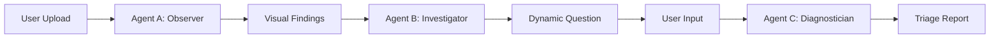

# VisionLink Product Requirements Document (PRD)

**Project Name:** VisionLink  
**Type:** Rural Triage Agent / Hackathon Submission  
**Goal:** Build an automated ophthalmic triage system using a multi-agent "Relay Race" architecture to detect diabetic retinopathy and other conditions, conduct patient interviews, and generate referral reports.

---

## 1. Architecture Overview (The Mental Model)

The system operates as a pipeline of three distinct AI agents, designed as a "Relay Race":

1.  **Agent A (The Observer):** Vision-Language Model (PaliGemma). "Sees" the image and extracts features.
2.  **Agent B (The Investigator):** LLM (MedGemma 9B). "Thinks" about the findings and asks a relevant history question.
3.  **Agent C (The Diagnostician):** LLM (MedGemma 9B). "Synthesizes" the visual data and patient history to generate a report.

**Data Flow:**


---

## 2. Technology Stack

*   **Vision Model:** `google/paligemma-3b-mix-224` (via `keras_nlp`)
    *   *Role:* Visual feature extraction.
*   **LLM:** `google/gemma-1.1-instruction-en` (MedGemma 9B, via `keras_nlp`)
    *   *Role:* Clinical reasoning and synthesis.
*   **Orchestration:** LangGraph
    *   *Role:* Managing the cyclic agent loop and state.
*   **Interface:** Gradio
    *   *Role:* Demonstration UI for judges.
*   **Dataset:** ODIR-5K (Ocular Disease Intelligent Recognition)
    *   *Role:* Validation and few-shot prompting examples.
*   **Optimization:** Float16 or Int8 quantization
    *   *Role:* Enabling "Rural/Low-resource" deployment on consumer hardware.

---

## 3. Implementation Phases

### Phase 1: Data Preparation (ODIR-5K)
*   **Source:** ODIR-5K dataset (Kaggle).
*   **Action:**
    *   Download dataset.
    *   Map "Left Eye" images to "Left Eye Keywords" (Excel).
*   **Goal:** Create pairs for "few-shot" prompting of Agent A to verify it can recognize features like "microaneurysms" or "cotton wool spots".
*   **Note:** Full training is NOT required; focus on verification and prompt-tuning.

### Phase 2: Agent A - The Observer (Vision-to-Text)
*   **Role:** Bridge the gap between Image and Text-only MedGemma.
*   **Model:** PaliGemma (`pali_gemma_3b_mix_224`).
*   **Input:** Retinal Scan Image.
*   **Output:** Descriptive text of findings (e.g., "Microaneurysms present, optic disc clear").
*   **Code Strategy:**
    ```python
    import keras_nlp
    import keras

    # Load PaliGemma
    pali_gemma = keras_nlp.models.PaliGemmaCausalLM.from_preset("pali_gemma_3b_mix_224")

    def get_visual_findings(image_path):
        # Few-shot prompting recommended here using ODIR examples
        prompt = "detect signs of diabetic retinopathy and glaucoma, and describe the optic disc and macula"
        
        output = pali_gemma.generate(
            inputs={
                "images": load_image(image_path),
                "prompts": [prompt]
            }
        )
        return output 
    ```

### Phase 3: Agent B - The Investigator (Dynamic Interview)
*   **Role:** Determine urgency by asking relevant medical history questions based on visual evidence.
*   **Model:** MedGemma 1.5 4B-IT (medgemma_1.5_4b_it).
*   **Input:** Visual Findings (Text from Agent A).
*   **Output:** ONE crucial follow-up question for the patient.
*   **Code Strategy:**
    
    ```python
    import torch
    from transformers import pipeline

    # Load the Jan 2026 MedGemma 1.5 weights via Hugging Face
    # Built on Gemma 3, optimized for medical reasoning and instruction following
    model_id = "google/medgemma-1.5-4b-it"

    pipe = pipeline(
        "image-text-to-text", 
        model=model_id, 
        torch_dtype=torch.bfloat16, 
        device_map="auto"
    )

    def generate_interview_question(visual_findings):
        system_prompt = """
        You are an ophthalmic nurse assistant. 
        Based on the visual findings from a retinal scan, determine ONE crucial follow-up question 
        to ask the patient to assess urgency (e.g., sudden vision loss, flashes, or floaters).
        """

        # Construct the conversation following the Gemma 3 chat template
        messages = [
            {
                "role": "user",
                "content": [
                    {"type": "text", "text": f"{system_prompt}\n\nVisual Findings: {visual_findings}"}
                ]
            }
        ]

        # Generate the response
        output = pipe(messages, max_new_tokens=128)
        return output[0]['generated_text']
    ```

### Phase 4: The Orchestration (LangGraph Loop)
*   **Logic:**
    1.  **Node 1 (Start):** Receive Image -> Run Agent A -> Get Findings.
    2.  **Node 2 (Investigate):** findings -> Run Agent B -> Get Question.
    3.  **Node 3 (Interaction):** Display Question -> Wait for User Answer.
    4.  **Node 4 (Synthesize/Check):** Run Agent C.
        *   *Condition:* Does Agent C have enough info for a diagnosis?
            *   *Yes:* Output Referral Report (End).
            *   *No:* Loop back to Node 2 (Ask another question).
*   **Agent C Prompt:** "You are a senior ophthalmologist. Review the visual findings: {findings} and the patient's history: {history}. Write a referral letter for a specialist. Include a Triage Level: Green (Routine), Yellow (Urgent), Red (Emergency)."

### Phase 5: User Interface (Gradio)
*   **Goal:** Simple, demonstrative UI for judges.
*   **Code Strategy:**
    ```python
    import gradio as gr

    def triage_pipeline(image, patient_notes):
        # Simplified pipeline for demo (non-loop version for basic UI)
        findings = get_visual_findings(image)
        question = generate_interview_question(findings)
        # In full app, this would be a chat interface. 
        # For simple demo:
        report = generate_final_report(findings, patient_notes)
        return findings, question, report

    ui = gr.Interface(
        fn=triage_pipeline,
        inputs=[gr.Image(type="filepath"), "text"],
        outputs=["text", "text", "text"],
        title="VisionLink: Rural Triage Agent"
    )
    ui.launch()
    ```

---

## 4. "Winning" Checklist & Narrative

### Checklist
1.  **Efficiency:** Ensure PaliGemma runs in `float16` or `int8` to demonstrate rural viability on low hardware.
2.  **Citation:** Explicitly state: "We used PaliGemma for the visual encoding to separate perception from reasoning, allowing MedGemma to focus on clinical logic."

### Scenario (The Story)
*   **Patient:** Maria.
*   **Context:** Lives 4 hours from a city.
*   **Flow:**
    1.  VisionLink sees optic disc cupping (early Glaucoma sign).
    2.  System asks: "Do you have a family history of glaucoma?"
    3.  Maria (or nurse) confirms "Yes".
    4.  System generates a **Yellow/Red** urgency referral for specialist evaluation.
